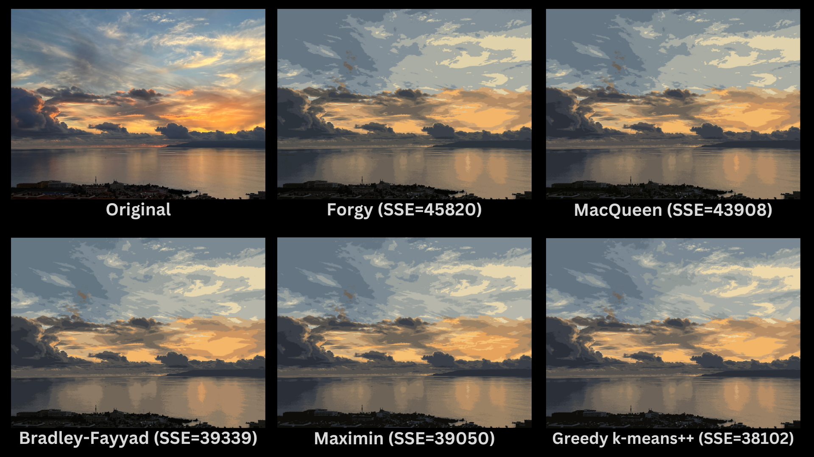

# K-Means Image Compression

Implements a k-means clustering algorithm and applies it to image compression. It provides various centroid initialization strategies and allows to compress images by reducing the number of colors used.

For a detailed walkthrough on how I used k-means for image compression, check out [this post](https://www.rdiachenko.com/posts/ml/k-means-image-compression/).

## Features

- Implements k-means clustering algorithm
- Supports multiple centroid initialization strategies:
    - Forgy
    - MacQueen
    - Maximin
    - Bradley-Fayyad
    - K-means++
    - Greedy K-means++
- Applies k-means clustering to compress images
- Command-line interface for easy use

## How It Works

The k-means image compression algorithm works as follows:

1. **Image Transformation**: The input image is transformed into a list of RGB values, where each pixel is represented as a point in 3D space.
2. **Centroid Initialization**: K initial centroids are chosen using one of the available strategies (e.g., k-means++).
3. **Clustering**: The k-means algorithm is applied:
    - Each pixel is assigned to the nearest centroid.
    - Centroids are recalculated based on the mean of all pixels assigned to them.
    - This process repeats until convergence or a maximum number of iterations is reached.
4. **Color Reduction**: After clustering, each pixel in the image is replaced with the color of its assigned centroid.
5. **Output**: The compressed image is saved, using only K colors.

This process reduces the color palette of the image while trying to maintain overall visual similarity to the original.

## Installation

You need to have Rust installed on your system. You can get it from [rust-lang.org](https://www.rust-lang.org/).

Clone the repository:

```bash
git clone https://github.com/rdiachenko/ml-lab.git
cd ml-lab
```

Build the project:

```bash
cargo build --package k_means --release
```

## Usage

To compress an image using k-means clustering:

```bash
cargo run --package k_means --release -- IMAGE K STRATEGY
```

Where:
- `IMAGE` is the path to your input image file
- `K` is the number of colors to use in the compressed image
- `STRATEGY` is a single letter code for the centroid initialization strategy:
    - `f` Forgy
    - `m` MacQueen
    - `x` Maximin
    - `b` Bradley-Fayyad
    - `k` K-means++
    - `g` Greedy K-means++

Example:

```bash
cargo run --package k_means --release -- /path/to/sky.png 16 k
```

This command will compress the image `sky.png` to use 16 colors, using the K-means++ initialization strategy.

## Results

Comparison of k-means initialization strategies for image compression (16 Colors):



### Observations

1. Compression reduced image size from 4.65 MB to 1 MB, a 78.5% reduction.
2. All strategies preserve overall image structure well with only 16 colors.
3. Greedy k-means++ achieves the lowest Sum of Squared Errors (SSE), closely followed by Maximin and Bradley-Fayyad.
4. MacQueen and Forgy methods show higher SSE values, indicating less effective compression.
5. Minor differences are most noticeable in sky details and color gradients.

## Documentation

To generate and view the documentation for this project:

```bash
cargo doc --package k_means --no-deps --document-private-items --open
```

This will build the documentation and open it in your default web browser.
